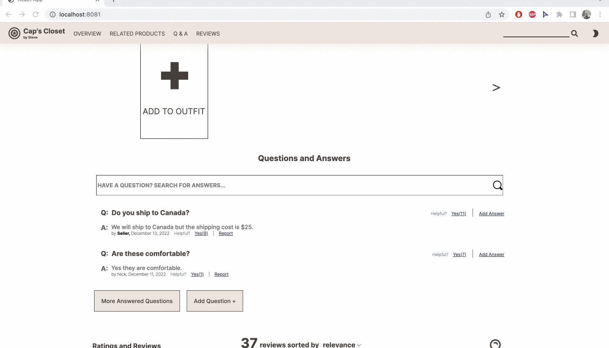
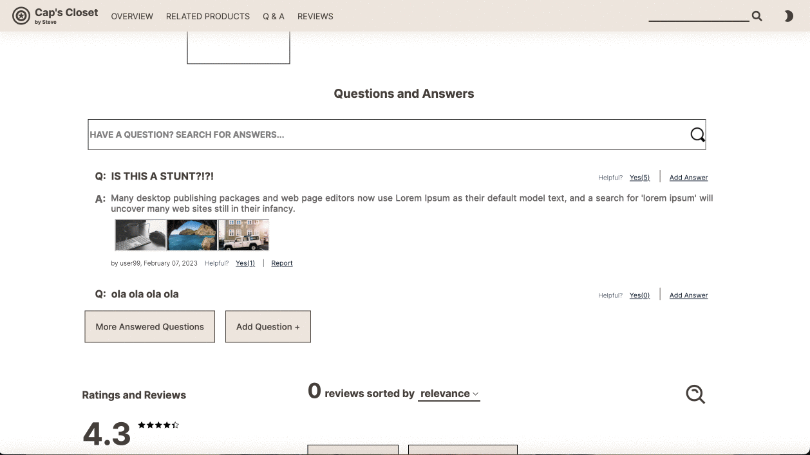
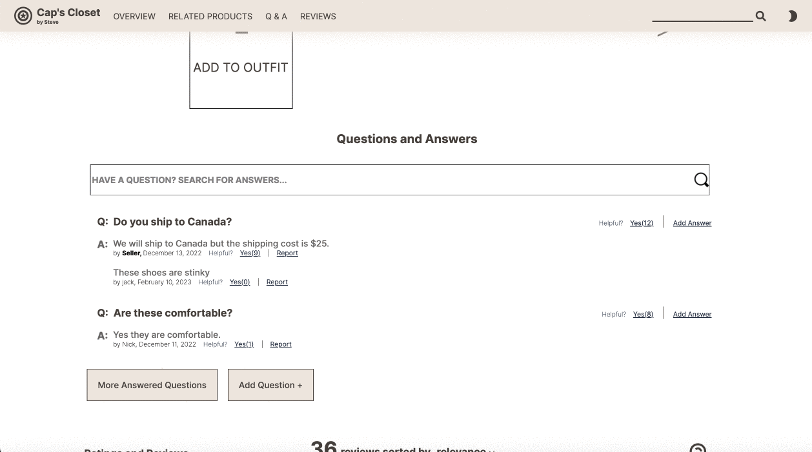
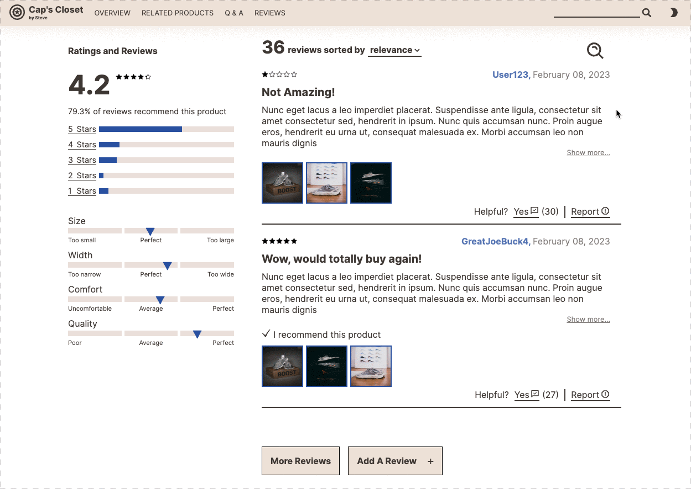

# FEC

## Related Projects

## Table of Contents
* [Usage](#usage)
* [Requirements](#requirements)
* [Features](#features)
  - [Overview](#overview)
  - [Related Products](#related-products)
  - [Questions and Answers](#questions-and-answers)
  - [Ratings and Reviews](#ratings-and-reviews)

## Usage

## Requirements

## Features

### Overview:

In the product overview, site visitors can:

- Navigate through multiple images via an image carousel
- View and zoom in on images of different clothing items
  - In the expanded view, zooming will follow mouse movement

- Preview images in the carousel with scrollable thumbnails
  - Buttons will dynamically render that allow users to scroll up and down through the thumbnails
  - Thumbnail scroll will track the user's most relevant recent interaction, whether with the style options, image carousel, or other thumbnails
- Explore different styles, and see which items are on sale
- Checkout by choosing a size and quantity of items
  - Thumbnail scroll will track the user's most relevant recent interaction, whether it's with the style options, image carousel, or other thumbnails

- Explore different styles, and see which items are on sale

- Checkout by choosing a size and quantity of items
  - all size and quantity options are specific to the selected item
- Favorite an item

- View the page in dark mode

### Related Products:

- View and navigate related products and their outfits
  - All products are designed as card, and contained in a carousel
  - The carousel will always scroll to the exact edge at the last card, in both directions
  - The carousel is reponsive to window resize, debounced to prevent unnecessary state change
  - The appearance and hover effect change corresponding to the dark mode

- Interect with any related product
  - The comparison table will show up when the star button at the top right corner of the card is clicked
  - The comparison table juxtapose features between current product and the related product clicked
  - The comparison table will close when mouse clicked on anywhere besides it
  - When any product card is clicked, the carousel will reset position and webpage will re-render correspondingly
  - Comparison table change its look corresponding to the dark mode

- Manipulate the "My Outfit" section
  - User may add the current product by pressing the first unique "Add to Outfit" card
  - User may remove any previously added product by click the "X" button at the top right corner of the card
  - "My outfit" is synced to each user's LocalStorage, so upon refresh or browser restart, data will persist

### Questions and Answers:

Questions and Answers provide an interactive way to learn more about a product.
 In the Questions and Answers section, users can :

 

- Search the question bank and any matching result(s) will render below
    - if there are no matches, the user will be given a message that there are no results and they can add their own question
- Users can add questions using the Add Question button which will open a modal and once submitted, on refresh the         question will be added
- Users can also add answers to asked questions using the Add Answer button on the side of the question and another modal will pop up
- Both of these modals have form validation and will not be submitted until the user fills out all the required information
- If a seller responds to a question, this answer will be at the top and seller will be bold to let the user know that the information is accurate

- Users can also click on pictures to zoom in

- Users can also report answers and they will be removed from view and be passed on for revision
- If the website is too bright for the user, they can toggle on dark mode
- In dark mode the questions and answers have a barely visible outline that the naked eye can't see but it creates a contrast that is less strenuous on the eyes and brings out the question and answer on the darker background

### Ratings and Reviews:

In the 'Ratings and Reviews' section, site visitors can:
- Filter and/or sort reviews
  - Filter reviews by star rating
    - Icons will indicate current active filters
    - Clicking on the icons will remove the corresponding filter
  - Filter reviews by search term
    - Clicking on the search icon will reveal a search input element
      - Will filter reviews based on the search term and highlight the corresponding term
    - Sort reviews via a drop down menu
      - Sort by relevance, date created (newest), or helpfulness
      - Upon switching sort mode, the reviews list will automatically scroll to the top
- Expand and navigate reviews
  - Upon click, the list will expand will expand to its maximum size and enable an infinite scroll feature

- Expand and view photos
  - Upon image click, an image carousel will appear where the user can navigate through the photos attached to the review
- Add a review
  - Upon click, a form modal will appear allowing the user to submit a review
  - Added images may be removed by clicking on them
  - A final validation check will run upon submit to ensure all mandatory requirements have been met

- Dark mode implementation
